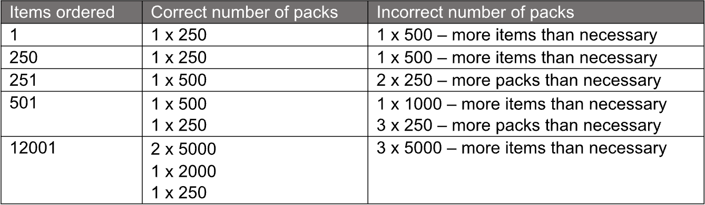

Software Engineering Challenge
Imagine for a moment that one of our product lines ships in various pack sizes:
- 250 Items
- 500 Items
- 1000 Items
- 2000 Items
- 5000 Items

Our customers can order any number of these items through our website, but they will
always only be given complete packs.
1. Only whole packs can be sent. Packs cannot be broken open.
2. Within the constraints of Rule 1 above, send out no more items than necessary to
   fulfil the order.
3. Within the constraints of Rules 1 &amp; 2 above, send out as few packs as possible to
   fulfil each order.
   So, for example:

Write an application that can calculate the number of packs we need to ship to the customer.
The API must be written in Golang &amp; be usable by a HTTP API (by whichever method you
choose).

Optional:
- Keep your application flexible so that pack sizes can be changed and added and
  removed without having to change the code.
- Create a UI to interact with your API
  Please also send us your code via a publicly accessible git repository, GitHub or similar is
  fine, and deploy your application to an online environment so that we can access it and test
  your application out.